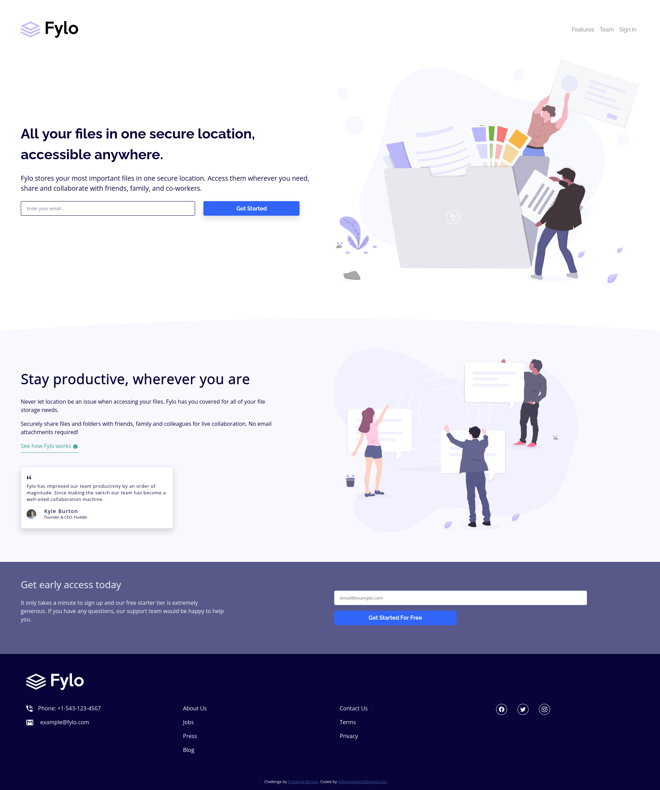

# Frontend Mentor - Fylo landing page with two column layout solution

This is a solution to the [Fylo landing page with two column layout challenge on Frontend Mentor](https://www.frontendmentor.io/challenges/fylo-landing-page-with-two-column-layout-5ca5ef041e82137ec91a50f5). Frontend Mentor challenges help you improve your coding skills by building realistic projects.

## Table of contents

- [Overview](#overview)
  - [Screenshot](#screenshot)
  - [Links](#links)
- [My process](#my-process)
  - [Built with](#built-with)
  - [What I learned](#what-i-learned)
  - [Useful resources](#useful-resources)
- [Author](#author)

## Overview

### Screenshot

### Links

- Solution URL: [https://github.com/kjdeepak/fylo-landing-page](https://github.com/kjdeepak/fylo-landing-page)
- Live Site URL: [https://vercel.com/kjdeepak/fylo-landing-page](https://vercel.com/kjdeepak/fylo-landing-page)

## My process

### Built with

- Semantic HTML5 markup
- CSS3
- SCSS
- Flexbox
- Mobile-first workflow
- Bootstrap v5

### What I learned

- How to apply css3 filter property to an svg image

### Useful resources

- [Bootstrap v5 Documentation](https://getbootstrap.com/docs/5.1/getting-started/introduction/) - CSS Framework

## Author

- Website - [K J Deepak](https://kjdeepak.com/)
- Github - [@kjdeepak](https://github.com/kjdeepak)
- Frontend Mentor - [@kjdeepak](https://www.frontendmentor.io/profile/kjdeepak)
- Twitter - [@k_j_deepak](https://www.twitter.com/k_j_deepak)